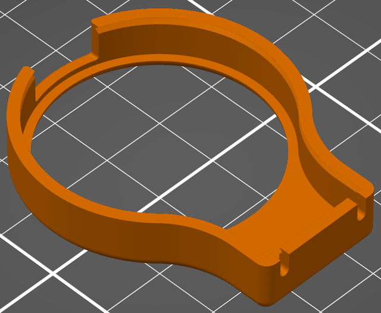

# Fibonacci LCD Pendant - RoundyFi

Wearable pendant made from a [RoundyFi](https://github.com/sbcshop/RoundyFi) 1.28-inch 240x240 LCD display with built-in ESP-12E ESP8266 microcontroller with wi-fi.

### Parts

* RoundyFi: https://amzn.to/3hKu6JO
* Wearable battery holder by Geek Mom Projects: https://www.geekmomprojects.com/category/wearables
* 3D printed case
  * [FibonacciLcdPendant-Front.stl](Case/FibonacciLcdPendant-Front.stl)
    
    

  * [FibonacciLcdPendant-Back.stl](Case/FibonacciLcdPendant-Back.stl)
    
    
